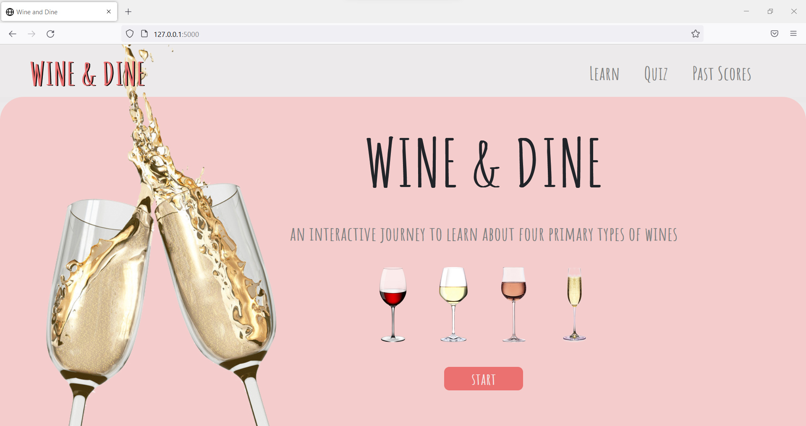
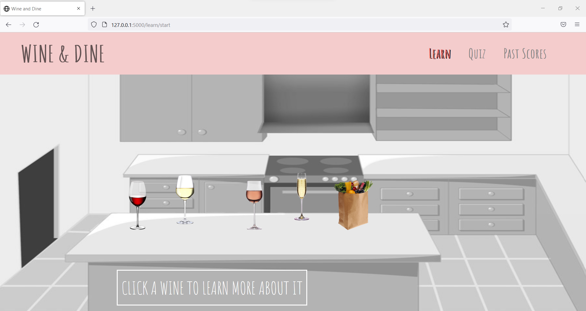
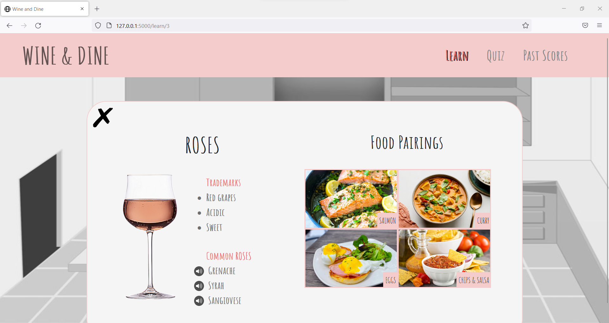
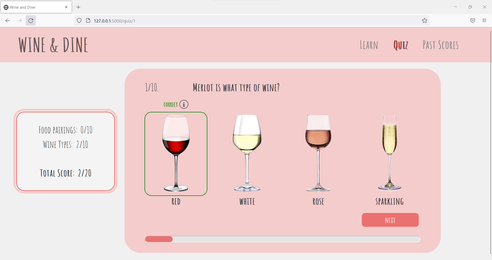
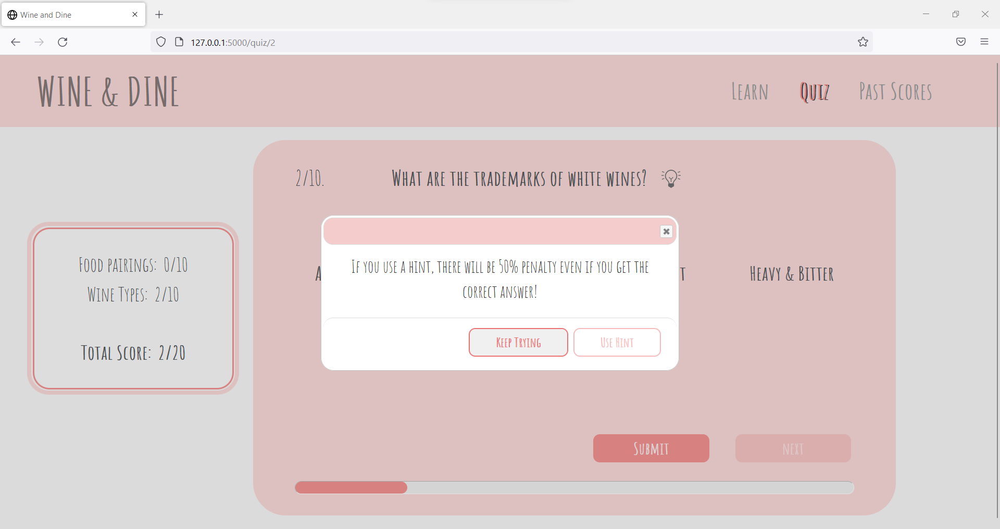
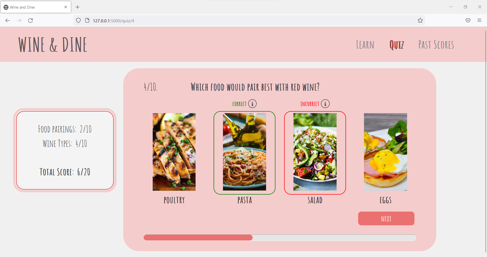
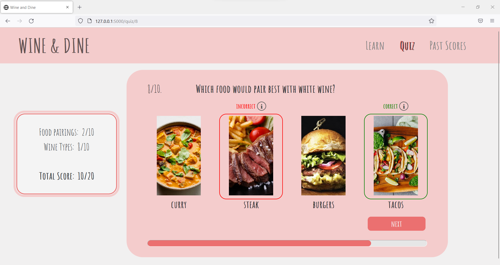

# Interactive-Learning-js-app
A Learning CRUD application in Javascript, HTML and CSS to teach various types of wine and their food pairings in 10 minutes utilizing interesting and interactive media

Demo Link: https://www.youtube.com/watch?v=9ILLX8CTJpI

| | |
|:-------------------------:|:-------------------------:|
| |  |
| |  |
| |  |
| |  |

### Steps to Run
  #### Install virtualenv
  `py -2 -m pip install virtualenv`

  #### Create Environment
  `mkdir <project name>`
  `cd <project name>`

  #### Activate Environment
  `<name of environment>\Scripts\activate`

  #### Install Flask
  `pip install Flask`
  
  #### Set FLASK_APP environment variable.
  `setx FLASK_APP "server.py"`

  #### Run the application
  `flask run`  
  or  
  `python server.py `

### References
This site is created for educational purposes as a group course project. 
