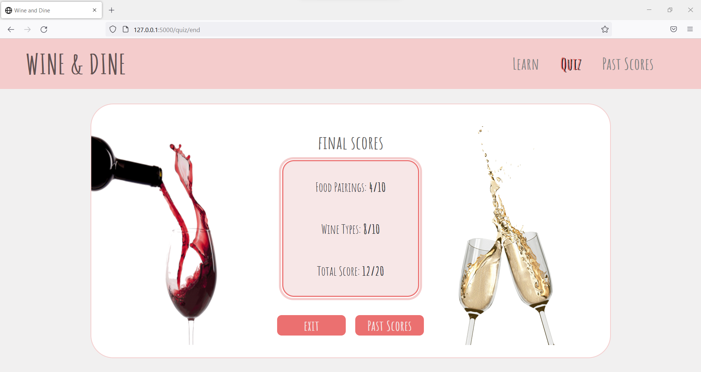

# Interactive-Learning-js-app
A Learning CRUD application in Javascript, HTML and CSS to teach various types of wine and their food pairings utilizing interesting and interactive media. The website is created in such a way using visual UI design tools to ensure that a user having no knowlegdge of any topic can easily learn the basics in not more than 10 minutes. The application was created after performing extensive user study on users might consider to be a good way to easily assimilate content for faster and richer learning experience. The website was later tested on users who found significant improvement in their knowledge of the subject after using this website. 

Demo Link: https://www.youtube.com/watch?v=9ILLX8CTJpI

| | |
|:-------------------------:|:-------------------------:|
| |  |
| |  |
| |  |
| |  |

### Steps to Run
  #### Install virtualenv
  `py -2 -m pip install virtualenv`

  #### Create Environment
  `mkdir <project name>`
  `cd <project name>`

  #### Activate Environment
  `<name of environment>\Scripts\activate`

  #### Install Flask
  `pip install Flask`
  
  #### Set FLASK_APP environment variable.
  `setx FLASK_APP "server.py"`

  #### Run the application
  `flask run`  
  or  
  `python server.py `

### References
This site is created for educational purposes as a group course project. 
